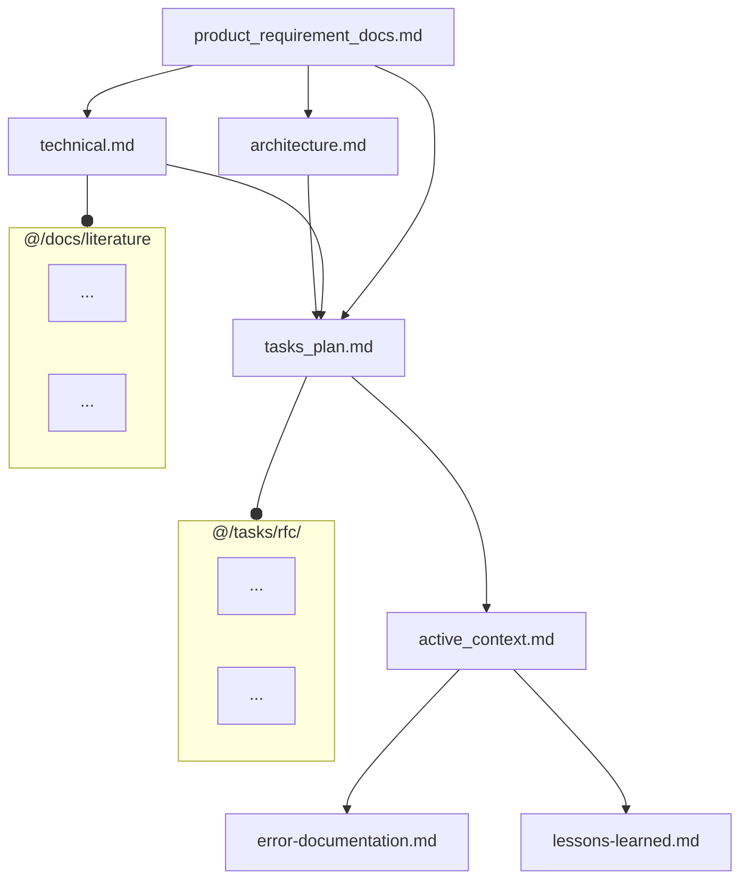
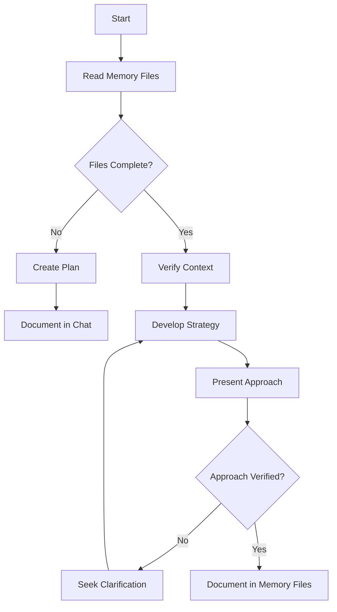
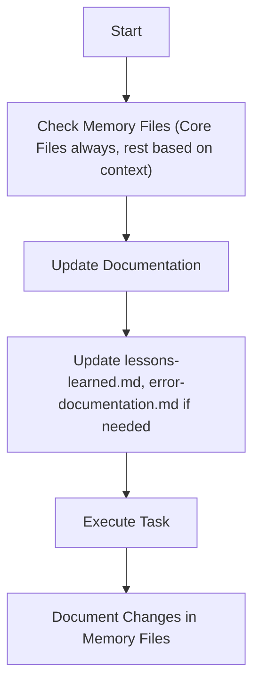
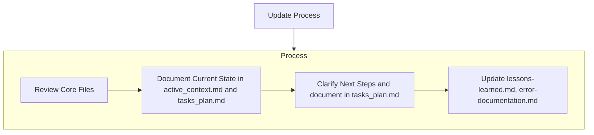
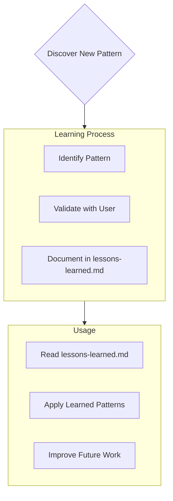

# Memory Files Structure

This outlines the fundamental principles, required files, workflow structure, and essential procedures that govern documentation, and maintaining a memory using file system.
The Memory Files consists of required core files and optional context files. Files build upon each other in a clear hierarchy:

## Core Files (Required)

7 files:

1. [product_requirement_docs.md](mdc:/memory/docs/product_requirement_docs.md) (/memory/docs/product_requirement_docs.md): Product Requirement Document (PRD) for the project or an SOP.

- Why this project exists
- Problems it solves
- Defines core requirements and goals
- Foundation document that shapes all other files
- Source of truth for project scope
- Created at project start if it doesn't exist

2. [architecture.md](mdc:/memory/docs/architecture.md) (/memory/docs/architecture.md): System architecture

- How it should work
- Component relationships
- Dependencies

3. [technical.md](mdc:/memory/docs/technical.md) (/memory/docs/technical.md): Development environment and stack

- Technologies used
- Development setup
- Key technical decisions
- Design patterns in use
- Technical constraints

4. [tasks_plan.md](mdc:/memory/tasks/tasks_plan.md) (/memory/tasks/tasks_plan.md): Detailed Task backlog

- In-Depth Tasks list and Project Progress
- What works
- What's left to build
- Current status
- Known issues

5. [active_context.md](mdc:/memory/tasks/active_context.md) (/memory/tasks/active_context.md): Current state of development

- Current work focus
- Active decisions and considerations
- Recent changes
- Next steps

6. [error-documentation.md](mdc:/rules_template/01-rules/error-documentation.md) (/rules_template/01-rules/error-documentation.md):

- During your interaction, if you find a fix to a mistake in this project or a correction you received reusable, you should take note in the error-documentation.md file so you will not make the same mistake again.
- Known issues: their state, context, and resolution

7. [lessons-learned.md](mdc:/rules_template/01-rules/lessons-learned.md) (/rules_template/01-rules/lessons-learned.md): learning journal for each project

- It captures important patterns, preferences, and project intelligence
- It is detailed in lessons-learned.md

## Context Files (Optional)

Detailed docs. Retrieve on demand if needed for context.

1. /docs/literature/ :

- literature survey and researches are in this directory
- Each literature topic is a latex file (docs/literature/\*.tex)

2. /tasks/rfc/ :

- contains RFC for each individual task in @tasks_plan.md
- RFCs will be in latex file format (tasks/\*.tex)

## Additional Context

Create additional files or folders as Memory files in docs/ or tasks/ when they help organize:

- Integration specifications
- Testing strategies
- Benchmarking setups
- Possible Extensions
- Deployment procedures

# Core Workflows

Now we define the procedural workflows to read/write to these memeory files.
The system operates in distinct MODES: (PLAN/ACT) or analogously (Architect/Code), controlled exclusively by the user input or the task in current request. Current input will determine the MODE, based on which the Workflow selection is always dictated. In user input explicit mode setting can also be specified by "MODE = PLAN MODE"/"Architect MODE" or "MODE = ACT MODE"/"Code MODE", so if explicit MODE setting present follow that, else guess the mode from the request. Ask for the MODE if you are not 100% confident, if any doubt ask explicitely.

## PLAN or Architect MODE

## ACT or Code MODE

# Documentation Updates

Memory Files updates occur when:

1. Discovering new project patterns
2. After implementing significant changes
3. When user requests with **update memory files** (MUST review ALL Core Files)
4. When context needs clarification
5. After significant part of Plan is verified

Note: When triggered by **update memory files**, I MUST review every Core memory file, even if some don't require updates. Focus particularly on [active_context.md](mdc:/memory/tasks/active_context.md) and [tasks_plan.md](mdc:/memory/tasks/tasks_plan.md) as they track current state.

# Project Intelligence ( [lessons-learned.mdc](mdc:/rules_template/01-rules/lessons-learned.mdc) [/rules_template/01-rules/lessons-learned.mdc] )

The [lessons-learned.mdc](mdc:/rules_template/01-rules/lessons-learned.mdc) file is my learning journal for each project. It captures important patterns, preferences, and project intelligence that help me work more effectively. As I work with you and the project, I'll discover and document key insights that aren't obvious from the code alone.

## What to Capture

- Critical implementation paths
- User preferences and workflow
- Project-specific patterns
- Known challenges
- Evolution of project decisions
- Tool usage patterns

The format is flexible - focus on capturing valuable insights that help me work more effectively with you and the project. Think of [lessons-learned.md](mdc:/rules_template/01-rules/lessons-learned.md) as a living document that grows smarter as we work together.
