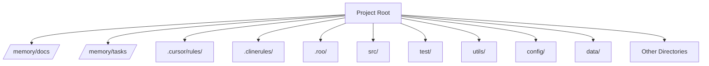

# Directory Structure

```mermaid
flowchart TD
    Root[Project Root]
    Root --> Docs[/memory/docs/]
    Root --> Tasks[/memory/tasks/]
    Root --> Cursor[.cursor/rules/]
    Root --> CLINE[.clinerules/]
    Root --> Roo[.roo/]
    Root --> SourceCode[src/]
    Root --> Test[test/]
    Root --> Utils[utils/]
    Root --> Config[config/]
    Root --> Data[data/]
    Root --> Other[Other Directories]
```
